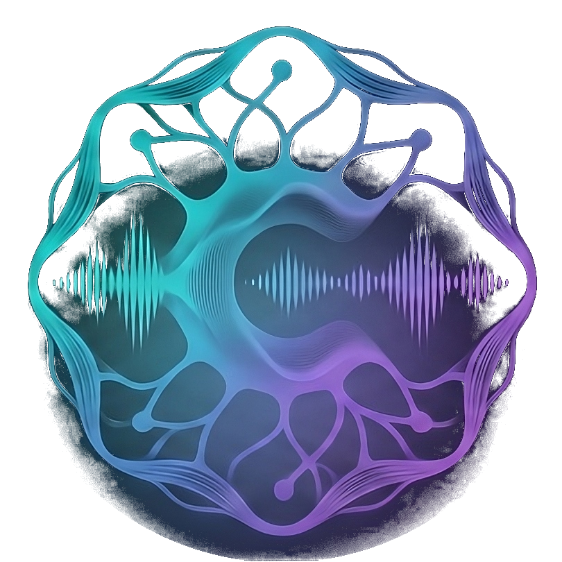

# <p align="center"><br>Concord</p>

<p align="center">
  <strong>Comunicação Descentralizada & Sem Fronteiras</strong>
</p>

<p align="center">
  <a href="https://github.com/nathatargino/Concord-Repo/releases"></a>
  <a href="https://react.dev/"></a>
  <a href="https://www.typescriptlang.org/"></a>
  <a href="https://www.electronjs.org/"></a>
  <a href="https://supabase.com/"></a>
  <a href="https://socket.io/"></a>
</p>

<p align="center">
  <a href="https://concord-olive.vercel.app/">🌐 Acessar Web App</a> •
  <a href="https://github.com/nathatargino/Concord-Repo/releases">💻 Baixar para Windows</a> •
  <a href="#-recursos-principais">✨ Recursos</a> •
  <a href="#-como-executar-o-projeto">🚀 Como Executar</a> •
  <a href="#-política-de-privacidade--concord">🔒 Política de Privacidade</a>
</p>

---

## 📖 Sobre o Concord

O **Concord** é uma plataforma de comunicação em tempo real de última geração, desenvolvida para conectar comunidades, equipes e amigos com máxima fluidez, privacidade e desempenho. 

Projetado com uma arquitetura moderna que combina **WebRTC**, **WebSockets (Socket.io)**, **Supabase** e **Electron com suporte a Widevine DRM**, o Concord oferece chamadas de voz com áudio HD cristalino, chat colaborativo em tempo real, canais customizáveis de texto e voz, compartilhamento de tela com áudio integrado e uma experiência inovadora de **Watch Party sincronizada** para YouTube, Netflix e Prime Video.

Disponível tanto como **aplicativo web** no navegador quanto como **aplicativo desktop nativo** para Windows.

---

## 🦎 Mascote Oficial — Cama-Voz

<p align="center">
  
</p>

<p align="center">
  <em>Assim como os camaleões se adaptam a qualquer ambiente, o Concord se adapta a você — seja para conversas com amigos, sessões de jogos, trabalho remoto, programação em equipe ou maratonar vídeos e filmes juntos!</em>
</p>

---

## ✨ Recursos Principais

### 🎙️ HD Audio & Voice Engine (WebRTC)
- **Áudio de Alta Definição:** Comunicação peer-to-peer otimizada via WebRTC com taxas de bits elevadas e latência ultrabaixa.
- **Cancelamento de Ruído & Noise Gate:** Supressão de ruído inteligente configurável com calibração de limiar (dBFS).
- **Gerenciamento Resiliente de Dispositivos:** Seleção de microfone e dispositivo de saída (alto-falantes/fones) com suporte a `setSinkId` e persistência automática no Electron e armazenamento local.
- **Controle de Volume Individual:** Ajuste fino de volume por participante, além de atalhos rápidos para mutar e ensurdecer.

### 💬 Chat Instantâneo em Tempo Real
- **Mensagens Ultrarrápidas:** Mensagens sincronizadas instantaneamente via Socket.io com persistência no Supabase.
- **Mídias e Interações:** Suporte a emojis nativos, integração com catálogo de GIFs (Giphy API), upload e visualização de anexos.
- **Feedback Visual Dinâmico:** Indicador de digitação (*typing indicator*), notificações de menção e timestamps precisos.

### 🍿 Watch Party & Streaming Sincronizado
- **Sincronização Coletiva:** Reprodução simultânea entre todos os participantes da sala para sessões de cinema e vídeos em grupo.
- **Suporte a DRM Widevine:** Aplicativo desktop equipado com versão especializada do Electron (Castlabs) e CDM Widevine certificado para reprodução em alta qualidade de plataformas como **Netflix** e **Amazon Prime Video**.
- **Player YouTube Nativo Integrado:** Fila de reprodução interativa, seleção de qualidade dinâmica e busca nativa do YouTube.
- **Picture-in-Picture (PiP):** Player flutuante e redimensionável para acompanhar o conteúdo enquanto navega por outros canais ou tarefas.

### 🖥️ Compartilhamento de Tela & Janelas
- **Captura Flexível:** Compartilhe a tela cheia ou janelas específicas de aplicativos.
- **Áudio do Sistema Integrado:** Transmissão de áudio da tela/janela sem eco ou realimentação (*loopback isolation*).

### 🏰 Servidores, Canais & Gerenciamento de Comunidade
- **Criação e Personalização:** Crie servidores com ícones personalizados, defina salas de voz e canais de texto temáticos.
- **Hierarquia de Cargos:** Permissões para Dono, Subdono e Membros.
- **Presença em Tempo Real:** Visualização dinâmica de status online, ausente e offline para todos os membros da comunidade.
- **Entrada Descomplicada:** Convites compartilháveis via link direto ou código de sala.

### 💻 Experiência Desktop Premium (Windows)
- **Bandeja do Sistema (System Tray):** Minimize para a área de notificação com inicialização em segundo plano (*auto-launch* opcional).
- **Notificações Nativas do Windows:** Notificações instantâneas para mensagens recebidas e eventos de canal.
- **Atualizações Automáticas:** Atualizações automáticas em segundo plano integradas diretamente via GitHub Releases.

---

## 🛠️ Tecnologias Utilizadas

| Camada | Tecnologias |
| :--- | :--- |
| **Frontend / Web Client** | React 19, TypeScript, Vite, Tailwind CSS 4, Zustand, Plyr, FontAwesome |
| **Desktop App** | Electron (Castlabs v43.5.0+wvcus), Widevine CDM, electron-builder, electron-updater |
| **Backend & Sinalização** | Node.js, Express, Socket.io, TypeScript, tsx, UUID, Multer |
| **Banco de Dados & Autenticação** | Supabase (PostgreSQL, Row Level Security, Realtime WebSockets, Storage) |
| **WebRTC & VoIP** | WebRTC PeerConnection, STUN/TURN Servers (Metered.ca), AudioContext API |
| **CI / CD & Distribuição** | GitHub Actions, Vercel (Web Deployment), GitHub Releases (Desktop Binaries) |

---

## 📁 Estrutura do Projeto

```text
Concord/
├── client/                     # Aplicação Frontend & Electron Desktop
│   ├── build/                  # Ícones, Widevine CDM e scripts de empacotamento
│   ├── electron/               # Código do processo principal (main, preload, streaming)
│   ├── src/
│   │   ├── components/         # Componentes React (Chat, Sidebar, Music, PiP, Perfil, etc.)
│   │   ├── hooks/              # Hooks customizados (WebRTC, Audio, Socket, YouTube, etc.)
│   │   ├── lib/                # Configurações do cliente Supabase
│   │   ├── services/           # Integração com APIs externas (YouTube Search, etc.)
│   │   ├── stores/             # Gerenciamento de estado global com Zustand
│   │   └── types/              # Definições de tipos TypeScript
│   └── vite.config.ts          # Configuração de build do Vite e plugins Electron
│
├── server/                     # Servidor de sinalização e backend em tempo real
│   └── src/
│       ├── hub.ts              # Gerenciador de salas, canais e roteamento de eventos
│       ├── index.ts            # Ponto de entrada do servidor Express & Socket.io
│       └── types.ts            # Tipagens do servidor
│
├── website/                    # Landing page oficial do Concord
│   ├── assets/                 # Logotipos, mascote, vídeos promocionais e imagens
│   ├── index.html              # Página principal com apresentação e links de download
│   └── ...
│
├── supabase/                   # Scripts de banco de dados
│   └── schema.sql              # Estrutura completa de tabelas, RLS e triggers do Supabase
│
└── package.json                # Gerenciamento do monorepo pnpm
```

---

## 🚀 Como Executar o Projeto

### Pré-requisitos
- [Node.js](https://nodejs.org/) (versão 20 ou superior recomendada)
- [pnpm](https://pnpm.io/) (versão 8 ou superior)
- Git

### 1. Clonar o Repositório
```bash
git clone https://github.com/nathatargino/Concord-Repo.git
cd Concord-Repo
```

### 2. Instalar as Dependências
```bash
pnpm install
```

### 3. Configurar as Variáveis de Ambiente

Crie um arquivo `.env` no diretório `client/`:
```env
VITE_SUPABASE_URL=https://seu-projeto.supabase.co
VITE_SUPABASE_ANON_KEY=sua-chave-anonima-do-supabase
VITE_SERVER_URL=http://localhost:3001
VITE_GIPHY_API_KEY=sua-chave-giphy-opcional
VITE_YOUTUBE_API_KEY=sua-chave-youtube-opcional
```

Se desejar configurar chaves personalizadas no servidor, crie um arquivo `.env` em `server/`:
```env
PORT=3001
CLIENT_URL=http://localhost:5173
SUPABASE_URL=https://seu-projeto.supabase.co
SUPABASE_SERVICE_ROLE_KEY=sua-chave-service-role
```

### 4. Executar em Modo de Desenvolvimento

Para iniciar o **servidor de sinalização** e o **cliente web** simultaneamente:
```bash
pnpm dev
```
- Web Client disponível em: `http://localhost:5173`
- Servidor Socket.io ativo em: `http://localhost:3001`

Para executar o **aplicativo desktop Electron** em modo de desenvolvimento:
```bash
pnpm --filter client electron:dev
```

*(No Windows, você também pode simplesmente executar o arquivo `start-dev.bat` presente na raiz).*

### 5. Compilação e Build

- **Build do Cliente Web:**
  ```bash
  pnpm build
  ```

- **Build do Instalador Desktop (Windows):**
  ```bash
  pnpm --filter client electron:build
  ```
  *(O instalador `Concord-Setup.exe` será gerado na pasta `client/release/`)*.

---

## 🔒 Política de Privacidade – Concord

**Última atualização:** Setembro de 2026

Esta Política de Privacidade explica como o aplicativo Concord processa dados e protege a privacidade dos usuários.

### 1. Informações Coletadas

- **Informações de Conta:** Podemos solicitar dados cadastrais básicos (como nome de usuário e e-mail) para autenticação e personalização de perfil.
- **Dados Operacionais e de Rede:** Informações técnicas de conexão (endereços IP temporários, portas e parâmetros de sessão) podem ser trafegadas para estabelecer a conectividade e transmissão de dados em tempo real.
- **Diagnósticos e Falhas:** Informações não identificáveis sobre erros do aplicativo podem ser coletadas para fins de correção de bugs e estabilidade.

### 2. Uso dos Dados

Os dados são utilizados unicamente para:
- Autenticar o usuário e manter sessões ativas;
- Viabilizar a comunicação e funcionamento central do software;
- Garantir a segurança e integridade técnica da plataforma.

### 3. Compartilhamento de Dados

Não vendemos, alugamos nem repassamos dados de usuários a terceiros com fins publicitários. Os dados só são compartilhados com provedores de infraestrutura de nuvem/rede estritamente necessários para o funcionamento do serviço.

### 4. Armazenamento e Segurança

Empregamos medidas de segurança padrão do setor (como criptografia de tráfego HTTPS/TLS) para proteger as comunicações e o armazenamento dos dados.

### 5. Exclusão de Dados e Contato

Os usuários podem solicitar a exclusão de suas contas ou esclarecer dúvidas sobre seus dados a qualquer momento pelo e-mail: [nathatargino.dev@gmail.com](mailto:nathatargino.dev@gmail.com).

---

## 👥 Desenvolvedores & Contato

<table align="center">
  <tr>
    <td align="center">
      <a href="mailto:nathatargino.dev@gmail.com">
        <br>
        <sub><b>Nathã Targino</b></sub>
      </a><br>
      <sub>Co-Fundador & Desenvolvedor</sub><br>
      <a href="mailto:nathatargino.dev@gmail.com">✉️ nathatargino.dev@gmail.com</a>
    </td>
    <td align="center">
      <a href="mailto:pedrohabrandao12@gmail.com">
        <br>
        <sub><b>Pedro Brandão</b></sub>
      </a><br>
      <sub>Co-Fundador & Desenvolvedor</sub><br>
      <a href="mailto:pedrohabrandao12@gmail.com">✉️ pedrohabrandao12@gmail.com</a>
    </td>
  </tr>
</table>

---

<p align="center">
  Feito com 💜 pela equipe do <strong>Concord</strong>. Todos os direitos reservados &copy; 2026.
</p>
